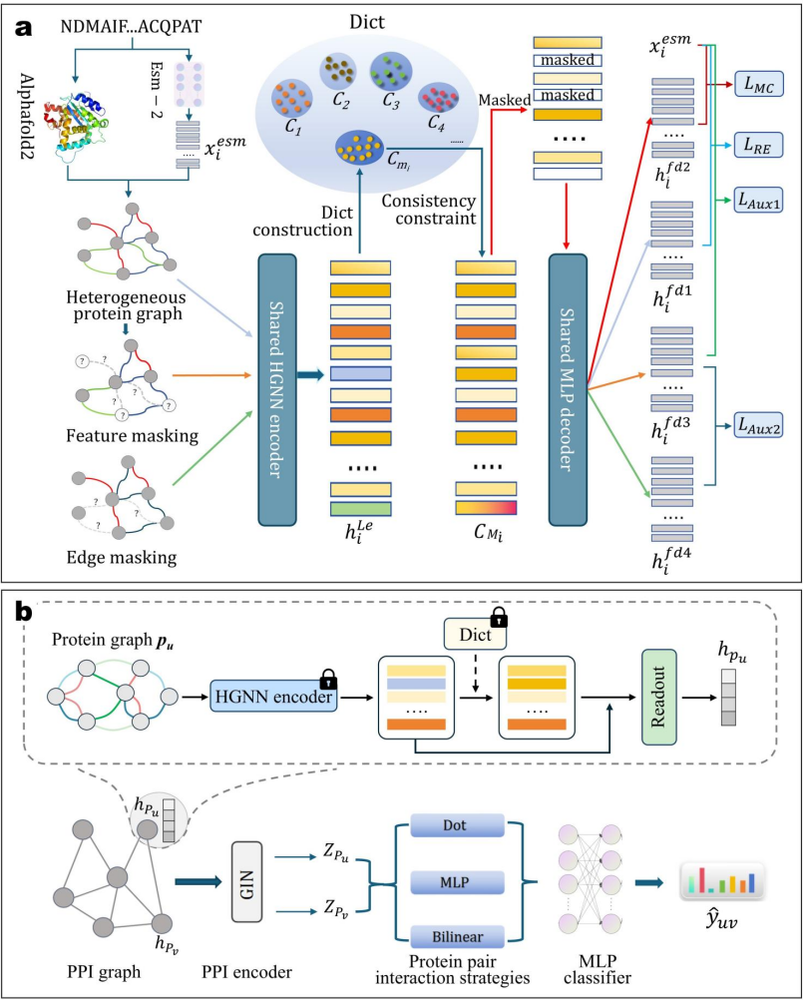

# MicroEnvPPI: Microenvironment-Aware Optimization for Protein–Protein Interaction Prediction

[](https://opensource.org/licenses/MIT)
[](https://www.python.org/downloads/release/python-380/)
[](https://pytorch.org/)
[](https://www.dgl.ai/)

This repository contains the official PyTorch implementation for our paper:

> **MicroEnvPPI: Microenvironment-Aware Optimization for Protein–Protein Interaction Prediction**
>
> *Kun Yang, Zhen Li, Yifan Chen, Linlin Zhuo*, Yanshi Wei, Haiyang Hu, Dongsheng Cao*, Aiping Lu, Quan Zou and Xiangzheng Fu**
>
> ([Link to Paper - TBD]())

## 框架概览

MicroEnvPPI 通过一个两阶段框架优化残基微环境表示，以实现高精度的PPI预测。核心思想是结合强大的ESM-2语言模型嵌入和创新的多任务自监督预训练策略（包含图对比学习）。


*图1: MicroEnvPPI框架概览，详细说明了带有辅助任务的预训练和下游PPI建模。*

## 快速开始：使用预训练模型进行评估

我们提供了在 **SHS27k** 数据集上针对三种不同划分方式（`random`, `bfs`, `dfs`）训练好的模型。您可以按照以下步骤快速复现评估结果。

#### 1. 准备环境和代码

```bash
# 克隆本仓库
git clone [https://github.com/yangkun021224/MicroEnvPPI.git](https://github.com/yangkun021224/MicroEnvPPI.git)
cd MicroEnvPPI

# 使用Conda创建并激活环境
conda env create -f environment.yml
conda activate MicroEnvPPI
```

#### 2. 下载数据和预训练模型

-   **必需：下载处理好的数据**
    -   我们强烈建议您直接下载我们处理好的数据，以跳过繁琐的数据预处理步骤。
    -   下载链接: [processed_data.zip (Google Drive)](https://drive.google.com/file/d/1mWrgzMxuHHIMsDA2OL8r0lNShiCUWc6Y/view?usp=drive_link)
    -   下载后，请解压并将得到的 `processed_data` 文件夹放入项目根目录下的 `data/` 文件夹中。

-   **必需：下载预训练模型**
    -   我们所有的实验结果和模型检查点都已上传。
    -   下载链接: [results (Google Drive)](https://drive.google.com/file/d/1lR8WeZTQMwOSnUFiruShmYzyPBiNJFmg/view?usp=drive_link)
    -   下载后，请解压并将得到的 `results` 文件夹放置在项目**根目录**下。

#### 3. 运行评估命令

下载并放置好上述文件后，您可以直接运行以下命令来评估对应的预训练模型：

```bash
# 进入 src 目录
cd src

# 在 SHS27k (random split) 上评估
python train.py --dataset SHS27k --split_mode random --ckpt_path "../results/SHS27k/2025-04-29_17-21-12_279/VAE_CL_Aux_RandMCM/vae_model.ckpt"

# 在 SHS27k (bfs split) 上评估
python train.py --dataset SHS27k --split_mode bfs --ckpt_path "../results/SHS27k/2025-04-30_01-13-55_572/VAE_CL_Aux_RandMCM/vae_model.ckpt"

# 在 SHS27k (dfs split) 上评估
python train.py --dataset SHS27k --split_mode dfs --ckpt_path "../results/SHS27k/2025-04-29_18-34-09_183/VAE_CL_Aux_RandMCM/vae_model.ckpt"
```
*注意：`--ckpt_path` 使用了相对路径 `../results/...`，这是因为我们是在 `src` 目录下执行命令。*

---

## 从零开始训练

如果您希望从原始数据开始，完整复现我们的数据处理和模型训练流程，请遵循以下步骤。

### 1. 安装环境
（同上文“快速开始”部分）

### 2. 数据准备

-   **下载原始数据**:
    -   下载链接: [raw_data.rar (Google Drive)](https://drive.google.com/file/d/1nq5UZIhkrMUsS_N4oVKs5l3fM82JsFZl/view?usp=drive_link)
    -   下载后解压，并将所有内容放入项目根目录下的 `raw_data/` 文件夹中。确保其中包含PDB文件所在的 `STRING_AF2DB` 子文件夹。

-   **生成ESM-2嵌入**:
    -   运行 `src/generate_esm_embeddings.py` 为您的数据集生成初始特征。
    -   **注意**: 运行前请务必修改脚本内的 `dataset` 和 `local_model_path` 变量。
    ```bash
    cd src
    python generate_esm_embeddings.py
    ```

-   **处理图结构数据**:
    -   运行 `src/data_process.py` 来处理PDB文件，并生成图的边文件。
    ```bash
    # 仍在 src 目录下
    python src/data_process.py --dataset <your_dataset_name>
    ```

### 3. 运行训练

-   **预训练 + 下游任务**:
    -   要完整地运行整个训练流程（先进行VAE预训练，然后进行下游GIN模型训练），请执行：
    ```bash
    # 仍在 src 目录下
    python train.py --dataset SHS148k --split_mode bfs --seed 42
    ```
    -   训练完成后，最优的VAE模型 (`vae_model.ckpt`) 和 GIN模型 (`model_..._best_state.pth`) 将保存在 `results/` 目录下。

-   **断点续训**:
    -   如果训练意外中断，您可以使用 `--resume` 参数从检查点恢复。
    ```bash
    # 示例：恢复GIN下游任务训练
    python train.py --dataset STRING --split_mode random --resume ../results/STRING/.../gin_cl_aux_randmcm_checkpoint.pth
    ```

## 引用

如果我们的工作对您的研究有所帮助，请考虑引用我们的论文：

```bibtex
@article{yang2024microenvppi,
  title={MicroEnvPPI: Microenvironment-Aware Optimization for Protein–Protein Interaction Prediction},
  author={Yang, Kun and Li, Zhen and Chen, Yifan and Zhuo, Linlin and Wei, Yanshi and Hu, Haiyang and Cao, Dongsheng and Lu, Aiping and Zou, Quan and Fu, Xiangzheng},
  journal={TBD},
  year={2024}
}
```

## 联系方式

如果您有任何问题或建议，欢迎通过GitHub Issue与我们交流，或直接联系通讯作者：
- **Linlin Zhuo**: 20210339@wzut.edu.cn
- **Dongsheng Cao**: oriental-cds@163.com
- **Xiangzheng Fu**: fxzheng@hkbu.edu.hk
```
